# DB-STRUCTURE — Complete Database Structure (v2 → v37)

> Program 2026-06 · Problem 1 (part A).
> Source of truth: every file under `supabase/*.sql` + `supabase/v5-split/`, `supabase/v9-split/`, `supabase/v10-split/` in this worktree, cross-checked against the live instance `https://syyntodkvexkbpjrskjj.supabase.co` (REST column-projection spot-checks, 2026-06-11).
> All citations are `file:line` relative to `supabase/` unless otherwise noted.

---

## 0. Reading guide & migration timeline

| Version | Files | What it does |
|---|---|---|
| v2 | `v2-schema.sql`, `v2-seed-admin.sql`, `v2-promote-admin.sql`, `v2-cleanup-admin.sql`, `v2-fix-admin-identity.sql`, `v2-fix-rls-recursion.sql` | Core: `user_profiles`, `projects`, `project_members`; admin seed; SECURITY DEFINER helpers to kill RLS recursion |
| v3 / v3.5 | `v3-progress-schema.sql`, `v3-5-progress-extras.sql` | `progress_items` tree + `can_view_project` / `can_edit_project_progress`; floor mode, assignment arrays, `progress_history` |
| v4 | `v4-issues-schema.sql`, `v4-fix-issue-update-rls.sql` | `issues`, `issue_comments`, `has_role_in_project`, `issue-photos` bucket; UPDATE `with check(true)` fix |
| v5 | `v5-push-notifications.sql`, `v5-split/1..7` | `app_config`, `user_profiles.onesignal_id`, pg_net, OneSignal push triggers |
| v6 | `v6-account-deletion.sql` | `delete_my_account()` RPC; FK loosening (`projects.created_by`, `project_members.approved_by` → SET NULL) |
| v8 | `v8-drawings.sql`, `v8-private-bucket-template.sql` | `drawings`, `drawing_versions`, private `project-drawings` bucket, `can_upload_drawing`, `supersede_drawing_version`; `demo_feedback` read-policy fix |
| v9 | `v9-chain-schema.sql`, `v9-rls-helpers.sql`, `v9-si-schema.sql`, `v9-vo-schema.sql`, `v9-rpc-submit-approval.sql`, `v9-default-chain-seed.sql`, `v9-account-deletion-extend.sql`, `v9-si-vo-storage-bucket.sql`, `v9-split/1..6` | Approval-chain spine (`approval_chain_steps`, `approvals`, `delegations`, `notification_counters`, `notification_digest`), SI + VO domains, `submit_approval`, `push_dispatcher`, digest cron |
| v10 | `v10-safety-officer-role.sql`, `v10-ptw-schema.sql`, `v10-split/1..7`, `v10-in-flight-approvals-include-submitter.sql`, `v10-submit-approval-add-ptw.sql`, `v10-ptw-test-backdate-fire-watch.sql` | PTW domain (5 tables), pgjwt QR, PTW cron expiry, safety_officer role, PTW branch in chain trigger + `submit_approval` |
| v11 | `v11-dailies-schema.sql`, `v11-events-schema.sql`, `v11-materials-schema.sql`, `v11-contacts-schema.sql`, `v11-get-timetable.sql`, `v11-next-progress-code.sql`, `v11-progress-visibility.sql` | v1.2 dailies / events / materials / contacts + `get_timetable`, `next_progress_code`, `get_visible_progress_items` |
| v12–v21 | `v12-*`, `v13`, `v14`, `v15`, `v16`, `v17`, `v18`, `v19`, `v20`, `v21` | Admin-bypass hotfixes, `general_foreman` role, progress-rights split, materials/user_profiles/audit RLS hardening, account-deletion FK cascade, member-peers SELECT |
| v22–v26 | `v22-mission-control.sql`, `v23-leads.sql`, `v24-perf-indexes.sql`, `v25-progress-snapshots.sql`, `v26-fix-project-discovery.sql` | Sales mission panel, leads, perf indexes, period snapshots, restore project discovery |
| v27–v37 | `v27`…`v37` | Membership-role-based progress rights, VO↔SI relaxation, applicant RPC saga (v30/31/33/35), PTW fire-watch RPC, sim-fix batches (v34/v35), issue-actor RPC (v36), PTW staffing guard (v37) |

There is **no v7 or v29** (namespaces skipped — `v8-drawings.sql:4`, v29 absent from the directory).

---

## 1. TABLE CATALOG

### 1.1 Live App Store tables — destructive changes FORBIDDEN

Per CLAUDE.md constraints ("New tables only; no destructive changes to `progress_leaf_items` or `user_profiles`"):

- **`user_profiles`** — live user identities. Only additive `ALTER` (new column v5; CHECK widening v10/v13) ever applied. **Never drop / narrow.**
- **`progress_items`** + **`progress_history`** — live progress data. Note: **`progress_leaf_items` does not exist as a table** — CLAUDE.md's name refers to leaf rows of `progress_items` (a leaf = a row with no children, enforced for drawings by `assert_progress_item_is_leaf`, `v8-drawings.sql:66-80`).
- **`projects`** / **`project_members`** — live membership graph; only FK/CHECK alterations have ever been applied.
- All v9/v10 audit ledgers (`approvals`, `*_versions`, `permit_signoffs`, `permit_scans`, `protest_comments`) are **append-only evidence**; migrations carry explicit "never drop user-data tables on re-run" warnings (`v9-chain-schema.sql:17-20`, `v9-si-schema.sql:43-47`).

### 1.2 Core (v2)

#### `user_profiles` — created `v2-schema.sql:19-29`
| Column | Type | Null | Default | Notes |
|---|---|---|---|---|
| id | uuid | NO | — | **PK**; FK → `auth.users(id)` ON DELETE CASCADE |
| phone | text | NO | — | UNIQUE |
| name | text | NO | — | |
| global_role | text | NO | — | CHECK: `admin,pm,main_contractor,subcontractor,subcontractor_worker,owner` (v2) **+ `safety_officer`** (`v10-safety-officer-role.sql:20-32`) **+ `general_foreman`** (`v13-general-foreman-role.sql:10-21`) |
| sub_role | text | YES | — | CHECK: `engineer,foreman,safety` |
| company | text | YES | — | locked from self-edit by trigger since v19 |
| created_at | timestamptz | YES | now() | |
| onesignal_id | text | YES | — | added `v5-push-notifications.sql:15` |

Indexes: `idx_user_profiles_phone` (v2:55), `idx_perf_user_profiles_role(global_role)` (`v24-perf-indexes.sql:20`).
Trigger: `trg_enforce_user_profile_write_gate` BEFORE UPDATE (`v17:88-91`, body replaced `v19-r3-followups.sql:23-60`) — non-admin writes silently revert `global_role, sub_role, phone, id, company` to OLD.

#### `projects` — created `v2-schema.sql:31-38`
| Column | Type | Null | Default |
|---|---|---|---|
| id | uuid | NO | gen_random_uuid() — **PK** |
| name | text | NO | — |
| zones | jsonb | NO | `'[]'` |
| assigned_pm_ids | uuid[] | NO | `'{}'` |
| created_by | uuid | YES | — FK → user_profiles **ON DELETE SET NULL** (re-pointed `v6-account-deletion.sql:18-25`) |
| created_at | timestamptz | YES | now() |

Trigger: `trg_seed_default_chain` AFTER INSERT (`v9-default-chain-seed.sql:125-127`) seeds SI/VO (+PTW since `v10-split/6`) default chains. `on_project_pm_changed` AFTER UPDATE of assigned_pm_ids (`v5:264-268`) pushes to new PMs.

#### `project_members` — created `v2-schema.sql:40-52`
| Column | Type | Null | Default |
|---|---|---|---|
| id | uuid | NO | gen_random_uuid() — **PK** |
| user_id | uuid | NO | — FK → user_profiles ON DELETE CASCADE |
| project_id | uuid | NO | — FK → projects ON DELETE CASCADE |
| role | text | NO | — CHECK: v2 set **+ `safety_officer`** (`v10-ptw-schema.sql:67-71`) **+ `general_foreman`** (`v13:23-33`) |
| status | text | NO | `'pending'` CHECK `pending,approved,rejected` |
| applied_at | timestamptz | YES | now() |
| approved_by | uuid | YES | — FK → user_profiles **SET NULL** (v6:28-34) |
| approved_at | timestamptz | YES | — |

UNIQUE `(user_id, project_id)` (v2:51). Indexes: project/user/status (v2:56-58) + v24 perf duplicates.
Trigger: `on_membership_updated` AFTER UPDATE (`v5:233-236`) pushes approve/reject.

### 1.3 Progress (v3 / v3.5 / v25)

#### `progress_items` — created `v3-progress-schema.sql:10-27`, extended `v3-5-progress-extras.sql:8-14`
| Column | Type | Null | Default | Origin |
|---|---|---|---|---|
| id | uuid | NO | gen_random_uuid() — **PK** | v3 |
| project_id | uuid | NO | — FK → projects CASCADE | v3 |
| parent_id | uuid | YES | — FK → progress_items CASCADE (self-tree) | v3 |
| code | text | NO | — (no DB uniqueness; see `next_progress_code`) | v3 |
| title | text | NO | — | v3 |
| zone_id | text | YES | — | v3 |
| level | int | NO | 1, CHECK ≥1 | v3 |
| planned_start / planned_end | date | YES | — | v3 |
| planned_progress / actual_progress | int | NO | 0, CHECK 0–100 | v3 |
| status | text | NO | `'not-started'` CHECK `not-started,in-progress,completed,delayed,blocked` | v3 |
| notes | text | NO | `''` | v3 |
| last_updated_by | uuid | YES | — FK → user_profiles, **SET NULL since v20** | v3 |
| last_updated_at / created_at | timestamptz | YES | now() | v3 |
| tracking_mode | text | NO | `'percentage'` CHECK `percentage,floors` | v3.5 |
| floor_labels / floors_completed | jsonb | NO | `'[]'` | v3.5 |
| assigned_to / delegated_to | uuid[] | NO | `'{}'` | v3.5 |

Trigger: `on_progress_assignment_changed` AFTER UPDATE when assigned/delegated changes (`v5:308-315`).

#### `progress_history` — created `v3-5-progress-extras.sql:19-27`
id uuid PK · item_id uuid NOT NULL FK → progress_items CASCADE · actual_progress int NOT NULL · floors_completed jsonb NOT NULL `'[]'` · notes text NOT NULL `''` · updated_by uuid FK → user_profiles (**SET NULL since `v20-delete-account-fk-cascade.sql:79`**) · created_at timestamptz now().
*Write path*: client `recordHistory` insert in `src/contexts/ProgressContext.tsx`, gated by the v34 policy (§4).

#### `progress_snapshots` — created `v25-progress-snapshots.sql:15-23`
id uuid PK · project_id FK → projects CASCADE NOT NULL · item_id FK → progress_items CASCADE NOT NULL · actual_progress int NOT NULL · period text NOT NULL · captured_at timestamptz NOT NULL now() · captured_by uuid FK → user_profiles.
UNIQUE index `(project_id, item_id, period)` (v25:26-27).

### 1.4 Issues (v4)

#### `issues` — created `v4-issues-schema.sql:10-26`
id uuid PK · project_id NOT NULL FK → projects CASCADE · reporter_id uuid FK → user_profiles (**was NOT NULL; nullable + SET NULL since `v20:77`**) · reporter_role text NOT NULL (snapshot) · title NOT NULL · description NOT NULL `''` · photos jsonb `'[]'` · current_handler_role text NOT NULL CHECK `pm,main_contractor,subcontractor,admin` · status NOT NULL `'open'` CHECK `open,resolved` · resolved_by uuid FK → user_profiles · resolved_at · created_at · updated_at.
Triggers: `on_issue_created` (push, `v5:132-135`), `on_issue_updated` (escalate/resolve/reopen push, `v5:195-198`).

#### `issue_comments` — created `v4-issues-schema.sql:33-44`
id uuid PK · issue_id NOT NULL FK → issues CASCADE · author_id uuid FK → user_profiles (**nullable + SET NULL since v20**) · action CHECK `reported,commented,escalated,resolved,reopened` · body `''` · from_role · to_role · created_at.

### 1.5 Push config (v5)

#### `app_config` — created `v5-push-notifications.sql:18-23`, extended `v10-ptw-schema.sql:74-75`
| Column | Type | Null | Default | Origin |
|---|---|---|---|---|
| id | int | NO | 1 — **PK**, CHECK `id = 1` (single row) | v5 |
| onesignal_app_id / onesignal_rest_key | text | YES | — | v5 |
| ptw_qr_secret | text | YES | — | v10 |
| ptw_enabled | boolean | NO | false | v10 |

RLS enabled, **zero policies → client deny-all** (v5:27). Only SECURITY DEFINER functions read/write it.

### 1.6 Drawings (v8)

#### `drawings` — created `v8-drawings.sql:32-41`
id uuid PK · project_id NOT NULL FK → projects CASCADE · **leaf_item_id** NOT NULL FK → progress_items CASCADE (leaf-only via trigger `drawings_leaf_only`, v8:78-80) · title NOT NULL · current_version_id uuid FK → drawing_versions **SET NULL** (deferred constraint v8:61-63) · created_by uuid FK → user_profiles SET NULL · created_at · updated_at.

#### `drawing_versions` — created `v8-drawings.sql:43-59`
id uuid PK · drawing_id NOT NULL FK → drawings CASCADE · version_no int NOT NULL · file_path text NOT NULL (`{project_id}/{drawing_id}/v{n}/{filename}`) · thumb_path · mime_type CHECK `application/pdf,image/jpeg,image/png` · size_bytes bigint NOT NULL · revision_label · status NOT NULL `'current'` CHECK `current,superseded,withdrawn` · uploaded_by FK → user_profiles SET NULL · uploaded_at · superseded_at · withdrawn_at · **UNIQUE (drawing_id, version_no)**.

### 1.7 Approval-chain spine (v9)

#### `approval_chain_steps` — created `v9-chain-schema.sql:36-44`
id uuid PK · project_id NOT NULL FK → projects CASCADE · doc_type CHECK `si,vo,ptw` · step_order int NOT NULL · required_role text NOT NULL · optional_user_id uuid FK → user_profiles · **UNIQUE (project_id, doc_type, step_order)**.

#### `approvals` — created `v9-chain-schema.sql:57-77` (append-only ledger)
| Column | Type | Null | Notes |
|---|---|---|---|
| id | uuid | NO | PK |
| doc_type | text | NO | CHECK `si,vo,ptw` |
| doc_id | uuid | NO | **polymorphic — intentionally no FK** (v9:60) |
| step_order | int | NO | |
| action_type | `approval_action_type` enum | NO | `approve, approve_with_edits, request_revision, reject, admin_override, delegate` (v9:48-55) |
| actor_id | uuid | was NO | FK → user_profiles; **nullable + SET NULL since `v20:73`** (was RESTRICT) |
| delegated_for_user_id | uuid | YES | FK → user_profiles |
| reason | text | YES | table CHECK: ≥10 chars when action ∈ request_revision/reject/admin_override (v9:69-76) |
| edits_jsonb | jsonb | YES | |
| created_at | timestamptz | NO | now() |

Trigger: `trg_approval_created` AFTER INSERT → `dispatch_after_approval()` (chain advance; v9-split/4, replaced v10-split/3).

#### `delegations` — `v9-chain-schema.sql:81-90`
id PK · user_id NOT NULL FK → user_profiles CASCADE · delegate_to NOT NULL FK → user_profiles CASCADE · valid_from date NOT NULL · valid_until date NOT NULL CHECK ≥ valid_from · created_at.

#### `notification_counters` — `v9-chain-schema.sql:92-97`
user_id FK → user_profiles CASCADE · hkt_date date · count int default 0 · **PK (user_id, hkt_date)**. RLS-enabled, **no policies** (server-only, 3 pushes/user/day cap).

#### `notification_digest` — `v9-chain-schema.sql:99-106`
id PK · user_id FK CASCADE · hkt_date · items_jsonb NOT NULL · sent_at · UNIQUE (user_id, hkt_date). Server-only.

### 1.8 SI / VO (v9)

#### `site_instructions` — `v9-si-schema.sql:51-65`
id PK · project_id NOT NULL FK → projects CASCADE · number text NOT NULL · current_version_id FK → si_versions SET NULL (deferred v9-si:86-88) · chain_snapshot jsonb (frozen at submit) · current_step int NOT NULL 0 · status NOT NULL `'draft'` CHECK `draft,submitted,in_review,approved,locked,revision_requested,rejected` · created_by uuid FK → user_profiles (**nullable + SET NULL since v20**, was NOT NULL RESTRICT) · created_at · submitted_at · locked_at · **UNIQUE (project_id, number)**.

#### `si_versions` — `v9-si-schema.sql:67-75`
id PK · si_id NOT NULL FK → site_instructions CASCADE · version_no int NOT NULL · payload jsonb NOT NULL · edits_by uuid FK (**SET NULL since v20**) · created_at · **UNIQUE (si_id, version_no)**. Trigger `trg_si_locked_guard` BEFORE INSERT rejects when parent locked (v9-si:252-254).

#### `protest_comments` — `v9-si-schema.sql:77-83`
id PK · si_id NOT NULL FK CASCADE · author_id uuid FK (**SET NULL since v20**) · body NOT NULL CHECK length>0 · created_at. Insert allowed only when SI locked (audit-only protest, D-14).

#### `variation_orders` — `v9-vo-schema.sql:61-77`, **relaxed `v28-vo-optional-si.sql`**
| Column | Type | Null | Notes |
|---|---|---|---|
| id | uuid | NO | PK |
| si_id | uuid | YES | v9: UNIQUE + FK RESTRICT (1 VO per SI). **v28: UNIQUE dropped, FK → SET NULL** — many VOs per SI, standalone VO allowed (`v28:26-33`) |
| project_id | uuid | NO | FK → projects CASCADE |
| number | text | NO | UNIQUE with project_id |
| current_version_id | uuid | YES | FK → vo_versions SET NULL (deferred) |
| total_amount_cents | bigint | YES | **server-only** — maintained by `trg_vo_sync_total`; RLS WITH CHECK forbids client change (v9-vo:261-271) |
| chain_snapshot / current_step / status / created_by / created_at / submitted_at / locked_at | — | — | same shape as SI; created_by **SET NULL since v20** |

Triggers: `trg_vo_versions_recompute` BEFORE INSERT on vo_versions (server recomputes line-item subtotals + total, v9-vo:135-137) · `trg_vo_sync_total` BEFORE INSERT/UPDATE OF current_version_id (v9-vo:161-163) · `trg_vo_locked_guard` (v9-vo:188-190).

#### `vo_versions` — `v9-vo-schema.sql:79-87`
id PK · vo_id NOT NULL FK → variation_orders CASCADE · version_no · payload jsonb NOT NULL (`{description, line_items[], total_amount_cents}`) · edits_by FK (**SET NULL since v20**) · created_at · **UNIQUE (vo_id, version_no)**.

### 1.9 PTW (v10)

#### `permits_to_work` — `v10-ptw-schema.sql:81-103`
| Column | Type | Null | Notes |
|---|---|---|---|
| id | uuid | NO | PK |
| project_id | uuid | NO | FK → projects CASCADE |
| number | text | NO | UNIQUE with project_id (`PTW-NNN`) |
| ptw_type | text | NO | CHECK `hot_work, work_at_height, lifting, confined_space, excavation, electrical, scaffold` |
| current_version_id | uuid | YES | FK → permit_versions SET NULL (deferred v10:142-148) |
| chain_snapshot | jsonb | YES | |
| current_step | int | NO | 0 |
| status | text | NO | `'draft'` CHECK `draft,submitted,in_review,approved,active,closed_out,expired,rejected,revision_requested` |
| created_by | uuid | was NO | FK → user_profiles (**SET NULL since v20**) |
| created_at / submitted_at / activated_at / expires_at / fire_watch_started_at / closed_out_at / locked_at | timestamptz | YES | `expires_at` = 23:59 HKT on activation day |

Partial index `idx_ptw_expires on (expires_at) where status='active'` (v10:153). Trigger `trg_ptw_locked_guard` on permit_versions (v10:295-297). Cron `ptw-expiry` `0 16 * * *` UTC → `drain_ptw_expiry()` (v10:519-524).

#### `permit_versions` — `v10:105-113` — id PK · ptw_id FK CASCADE · version_no · payload jsonb · edits_by FK (**SET NULL since v20**) · created_at · UNIQUE (ptw_id, version_no).
#### `permit_workers` — `v10:115-122` — id PK · ptw_id FK CASCADE · worker_name NOT NULL · worker_phone · worker_photo_path · created_at.
#### `permit_signoffs` — `v10:124-131` — id PK · approval_id NOT NULL FK → approvals CASCADE **UNIQUE** · ptw_id NOT NULL FK CASCADE · signature_b64 NOT NULL · created_at. (Signature sidecar; one per approval row.)
#### `permit_scans` — `v10:133-139` — id PK · ptw_id FK CASCADE · scanned_by uuid FK → user_profiles (**SET NULL since v20**) · scanned_at now() · jwt_payload_snapshot jsonb NOT NULL. (QR scan audit.)

### 1.10 Daily-ops tables (v11)

#### `dailies` — `v11-dailies-schema.sql:17-30`
id PK · project_id NOT NULL FK → projects CASCADE · **user_id NOT NULL FK → `auth.users` CASCADE** (not user_profiles) · date date NOT NULL · weather CHECK `晴,陰,雨,暴雨,熱,凍,大風` · progress_item_ids uuid[] `'{}'` · freeform_items text[] `'{}'` · notes · created_at · updated_at · **UNIQUE (project_id, user_id, date)**. Trigger `trg_dailies_updated_at`.

#### `events` — `v11-events-schema.sql:16-28`
id PK · project_id NOT NULL FK CASCADE · title NOT NULL · description · starts_at timestamptz NOT NULL · ends_at · location · event_type `'other'` CHECK `meeting,inspection,milestone,other` · created_by FK → auth.users SET NULL · created_at · updated_at. Trigger `trg_events_updated_at`.

#### `materials` — `v11-materials-schema.sql:18-49`
id PK · project_id NOT NULL FK CASCADE · name NOT NULL · unit NOT NULL · qty_needed numeric CHECK >0 · qty_arrived numeric NOT NULL 0 CHECK ≥0 · item_ids uuid[] `'{}'` (GIN-indexed) · requested_by FK → auth.users SET NULL · planned_arrival_at · arrived_at · notes · created_at · updated_at · **status text GENERATED ALWAYS AS (qty case) STORED** → `arrived|partial|requested` ("late" computed client-side). Trigger `trg_materials_updated_at` also auto-stamps `arrived_at` on full receipt (v11-materials:55-66).

#### `contacts` — `v11-contacts-schema.sql:14-25`
id PK · project_id NOT NULL FK CASCADE · name NOT NULL · trade NOT NULL · phone NOT NULL · notes · created_by FK → auth.users SET NULL · created_at · updated_at. Trigger `trg_contacts_updated_at`.

### 1.11 Sales / web-only tables (v22, v23)

#### `mission_tasks` — `v22-mission-control.sql:13-26` — id PK · title NOT NULL · description `''` · status `'pending'` CHECK `pending,in_progress,completed,blocked` · priority `'medium'` CHECK `low,medium,high,urgent` · category `'outreach'` CHECK 7 values · owner `'user'` CHECK `user,agent,both` · due_date · notes · sort_order int 0 · created_at · updated_at (trigger).
#### `mission_log` — `v22:69-75` — id PK · author CHECK `user,agent,system` · body NOT NULL · tags text[] `'{}'` · created_at.
#### `mission_metrics` — `v22:96-108` — id text PK `'current'` (single-row CHECK) · mrr_hkd int 0 · customers_signed int 0 · pilots_active int 0 · demos_run int 0 · outreach_sent int 0 · replies_received int 0 · current_focus text · updated_at.
#### `leads` — `v23-leads.sql:12-23` — id PK · name NOT NULL · company `''` · contact NOT NULL · message `''` · source `'sell'` · status `'new'` CHECK `new,contacted,demo,pilot,won,lost` · notes `''` · created_at.

### 1.12 Out-of-band & legacy tables

- **`demo_feedback`** — created by `scripts/create-feedback-table.sql` (not a `supabase/` migration): id PK · scenario · user_id FK → auth.users SET NULL · username · user_name · role_zh · rating CHECK 1–5 · category · message · created_at. Read policy replaced with admin-only in `v8-drawings.sql:228-241`.
- **Legacy v1 tables** (predate v2, never created by any repo migration, still live): `profiles`, `sub_contracts`, `boq_items`, `daily_diaries`, `material_requests`, `ncrs`, `ptw_requests`, `submittals`, `toolbox_talks`. All policies wiped and replaced with one admin-only SELECT in `v18-rls-audit-hardening.sql:41-72`; author FKs flipped to NULL+SET NULL in `v20:88-91` so account deletion isn't blocked.
- `_cron_rehearsal_log` — transient (created v10-split/2, dropped `v10-ptw-schema.sql:42`).
- `site_messages`, `issue_history` — v1 tables dropped by `v2-schema.sql:8-15`.

### 1.13 Storage buckets, extensions, cron, sequences

| Object | Created | Notes |
|---|---|---|
| bucket `issue-photos` | `v4:126-128` | **public** read |
| bucket `project-drawings` | `v8:27-29` | **private** — signed URLs only; blobs immortal (no update/delete policies) |
| bucket `project-si-vo` | `v9-si-vo-storage-bucket.sql:18-20` | **private**; subcontractor allowed to upload (differs from drawings) |
| ext `pg_net` | v5:12 | outbound HTTP from triggers |
| ext `pg_cron` | v9-split/6 | digest + PTW expiry jobs |
| ext `pgjwt` | v10-split/1 | HS256 sign/verify for PTW QR |
| cron `si-vo-digest` `0 0 * * *` UTC | v9-split/6 | = 08:00 HKT digest drain |
| cron `ptw-expiry` `0 16 * * *` UTC | v10:519-524 | = 00:00 HKT next day: active→expired |
| sequences `si_seq_<uuid>` / `vo_seq_<uuid>` / `ptw_seq_<uuid>` | lazily by `next_*_number` | per-project document numbering |

### 1.14 Live spot-verification (2026-06-11)

Verified by REST column-projection against `https://syyntodkvexkbpjrskjj.supabase.co/rest/v1/` (a select of a non-existent column returns `42703`; all the following returned HTTP 200):

1. `permits_to_work` — all 16 cataloged columns incl. `fire_watch_started_at`, `closed_out_at`, `locked_at` ✔
2. `site_instructions` — 10 columns incl. `chain_snapshot`, `current_step`, `locked_at` ✔
3. `materials` — 12 columns incl. generated `status`, `item_ids`, `arrived_at` ✔
4. `progress_items` — 18 columns incl. v3.5 additions `tracking_mode`, `floor_labels`, `floors_completed`, `assigned_to`, `delegated_to` ✔
5. `approval_chain_steps` — all 6 columns ✔
6. `variation_orders` — incl. `si_id`, `total_amount_cents` ✔ · `dailies` (8 cols) ✔ · `user_profiles` (incl. `onesignal_id`) ✔ · `progress_snapshots` ✔
7. Negative control: `permits_to_work.bogus_col` → `42703 column does not exist` ✔. Anon role sees 0 rows everywhere (discovery policy is `to authenticated`), confirming RLS posture.

---

## 2. FUNCTION → TABLE MATRIX

Legend: **SD** = SECURITY DEFINER. "Gate" = the authorization enforced inside the function (RLS-bypassing functions must self-gate). R = reads, W = writes.

### 2.1 RLS helper predicates (called from policies; no own gate)

| Function | Defined / last body | SD | Reads |
|---|---|---|---|
| `can_view_project(uid, project)` | `v3:33-49` | ✔ | user_profiles, projects, project_members |
| `can_edit_project_progress(uid, project)` | `v3:51-71` | ✔ | user_profiles, projects, project_members (**membership** role ∈ pm/main_contractor/subcontractor) |
| `can_manage_project_progress(uid, project)` | v15:25-40 → **`v27:31-46`** | ✔ | user_profiles, projects, project_members (**membership** role ∈ pm/general_foreman/main_contractor since v27) |
| `can_update_progress_item(uid, item)` | `v15:42-57` | ✔ | progress_items (+ can_manage) — manager OR `assigned_to`/`delegated_to` member |
| `can_upload_drawing(uid, project)` | `v8:91-108` | ✔ | user_profiles, projects, project_members (excludes subcontractor, D-25) |
| `has_role_in_project(uid, project, role)` | `v4:49-73` | ✔ | user_profiles, projects, project_members |
| `is_pm_of_project(uid, project)` | `v2-fix-rls-recursion.sql:50-62` | ✔ | projects |
| `is_approved_member_of_project(uid, project)` | `v2-fix:34-47` | ✔ | project_members |
| `is_approved_member_of_project(project)` (1-arg) | `v21:16-37` (row_security=off) | ✔ | project_members |
| `is_approved_subcontractor_in_project(uid, project)` | `v2-fix:17-31` | ✔ | project_members |
| `can_view_si / can_view_vo / can_view_ptw` | `v9-si:187-198` / `v9-vo:193-204` / `v10:256-263` | ✔ | parent doc table + can_view_project |
| `user_is_admin()` | `v12-admin-bypass-v11-tables.sql:25-31` | ✔ | user_profiles |
| `is_admin()` | `v24:46-58` (provided, **not yet wired into any policy**) | ✔ | user_profiles |
| `is_material_supervisor(uid, project)` | `v16:32-49` | ✔ | user_profiles, projects (note: global pm/general_foreman matches regardless of project; only assigned-PM branch is project-scoped) |
| `shares_project_with(user)` | `v17:96-120` (row_security=off) | ✔ | project_members |
| `is_pm_of_applicant(target)` | `v17:122-143` (row_security=off) | ✔ | projects, project_members |
| `active_role_holders(project, role)` | `v9-rls-helpers.sql:24-59` | ✔ | user_profiles (admins), projects (assigned PMs), project_members, delegations |
| `in_flight_approvals(user)` | v9-rls-helpers:70-125 → **`v10-in-flight-approvals-include-submitter.sql:26-105`** | ✔ | site_instructions, variation_orders, permits_to_work (+ active_role_holders) |

### 2.2 Client-callable RPCs

| RPC | Defined / last body | Gate | R | W |
|---|---|---|---|---|
| `delete_my_account()` | v6:42-59 → **`v9-account-deletion-extend.sql:23-61`** (returns json) | auth.uid(); blocked when `in_flight_approvals(uid) > 0` | SI/VO/PTW via helper | **DELETE auth.users** (cascade → user_profiles, project_members, …; SET NULL on authored content per v6/v20) |
| `supersede_drawing_version(...)` | `v8:115-156` — **NOT SD** (RLS applies to caller) | caller must pass `can_upload_drawing` via RLS | drawing_versions | drawing_versions (insert + supersede update), drawings (current_version_id) |
| `next_si_number / next_vo_number / next_ptw_number (project)` | `v9-si:211-228` / `v9-vo:212-228` / `v10:267-279` | any authenticated (no membership check) | — | creates/advances per-project sequence |
| `submit_si(si)` | v9-si:264-337 → **`v35:106-186`** (+content guard) | creator only; status draft/revision_requested; `current_version_id` non-null (v35) | site_instructions FOR UPDATE, approval_chain_steps | site_instructions (chain_snapshot, status→in_review); push via `push_dispatcher` |
| `submit_vo(vo)` | v9-vo:323-401 → **`v28:65-137`** (SI-lock check only when si_id set) | creator only | variation_orders FOR UPDATE, site_instructions, approval_chain_steps | variation_orders; push |
| `submit_ptw(ptw)` | v10:379-437 → **`v37:45-134`** (+staffing fail-fast guard) | creator only; every chain step must resolve ≥1 holder (v37) | permits_to_work FOR UPDATE, approval_chain_steps, active_role_holders | permits_to_work; push |
| `submit_approval(doc_type, doc_id, action, reason, edits)` | v9-rpc-submit-approval:19-147 → **`v10-submit-approval-add-ptw.sql:20-145`** | actor ∈ `active_role_holders(project, step role)` OR pinned optional_user OR admin; `admin_override` ⇒ admin; reason ≥10 chars for blocking actions | si/vo/ptw FOR UPDATE, user_profiles, delegations, project_members | **approvals INSERT** (only legal write path — direct INSERT denied); on approve_with_edits also si_versions/vo_versions INSERT + parent current_version_id |
| `save_chain_steps(project, doc_type, steps)` | `v9-default-chain-seed.sql:43-95` | admin OR assigned PM | user_profiles, projects | approval_chain_steps (delete-then-insert atomically) |
| `verify_ptw_jwt(token)` | `v10:339-376` | authenticated + `can_view_project` on the permit's project | app_config (secret), permits_to_work; `extensions.verify` | **permit_scans INSERT** (audit) |
| `mint_ptw_jwt(permit)` | `v10:302-334` (server-only) → **granted to authenticated `v34:14`** | permit must be `active` with expiry; reads secret server-side (no project-visibility check — permit UUID is the capability) | permits_to_work, app_config | — (returns signed JWT) |
| `close_out_ptw(ptw, signature)` | v10:464-505 → **`v10-split/5`** (acted_at→created_at fix) | creator; status=active; hot_work ⇒ fire-watch ≥30 min; signature ≥100 chars | permits_to_work FOR UPDATE, approvals | approvals INSERT, permit_signoffs INSERT, permits_to_work → closed_out |
| `record_ptw_signoff(ptw, signature)` | v10-split/4 → **v10-split/5** | authenticated; attaches to caller's latest un-signed approval | approvals, permit_signoffs | permit_signoffs INSERT |
| `start_ptw_fire_watch(ptw)` | `v32:32-58` | creator; hot_work; active; not already started | permits_to_work FOR UPDATE | permits_to_work.fire_watch_started_at |
| `backdate_ptw_fire_watch(ptw, mins)` | `v10-ptw-test-backdate-fire-watch.sql:19-49` | **admin only** (test/recovery helper) | user_profiles | permits_to_work.fire_watch_started_at |
| `get_ptw_enabled()` / `set_ptw_enabled(bool)` | `v10-split/7` | any authenticated / **admin only** | app_config | — / app_config.ptw_enabled |
| `get_timetable(project, from, to)` | v11-get-timetable → v12-admin-bypass-rpcs → **`v34:23-118`** | admin OR approved member; v34: completion branch additionally per-item (manager OR assigned/delegated) | materials, progress_items, events | — |
| `next_progress_code(project, zone, parent)` | v11-next-progress-code → **`v12-admin-bypass-rpcs.sql:104-…`** | admin OR approved member | progress_items | — |
| `get_visible_progress_items(project)` | v11 → v12 → v13 → v14 → **`v27:48-92`** | admin / `can_manage_project_progress` (full tree) / approved member (assigned+ancestor chain) / else empty | progress_items, project_members, user_profiles | — |
| `admin_list_user_profiles()` / `admin_get_user_profile(user)` | `v17:147-186` (row_security=off) | **admin only** | user_profiles | — |
| `admin_update_user_role(target, role, sub_role)` | `v17:188-213` | **admin only** | user_profiles | user_profiles.global_role/sub_role |
| `admin_or_pm_list_applicants(project)` | v30 → v31 (PII filter) → v33 (ambiguous-id fix) → **`v35:38-83`** (re-applied live) | admin/assigned PM → all pending; approved subcontractor → pending `subcontractor_worker` only | project_members, user_profiles, projects | — |
| `get_issue_actor_profiles(project)` | `v36:25-54` | `can_view_project` | issues, user_profiles | — (returns {id,name} of issue reporters/resolvers only) |
| `pm_assign_safety_officer(project, user)` | `v37:141-179` | admin OR assigned PM; target must be approved member | user_profiles, projects, project_members | project_members.role → 'safety_officer' |
| `in_flight_approvals(user)` | (granted to authenticated) | none — counts caller-supplied uid | see §2.1 | — |
| `active_role_holders / can_view_si / can_view_vo / can_view_ptw / user_is_admin / is_material_supervisor / shares_project_with / is_pm_of_applicant / is_approved_member_of_project(uuid) / can_manage_project_progress / can_update_progress_item / next_*_number` | — | granted to authenticated (read-only predicates) | see §2.1 | — |

### 2.3 Server-only functions (revoked from authenticated/anon)

| Function | Defined | Trigger/Caller | R | W |
|---|---|---|---|---|
| `push_dispatcher(target, payload)` | `v9-split/1` | submit_si/vo/ptw, dispatch_after_approval | app_config | notification_counters (upsert), notification_digest (4th+ msg); `net.http_post` → OneSignal |
| `drain_notification_digest()` | `v9-split/6` | cron `si-vo-digest` | app_config, notification_digest | notification_digest.sent_at; http_post |
| `drain_ptw_expiry()` | `v10:508-517` | cron `ptw-expiry` | permits_to_work | permits_to_work active→expired |
| `activate_ptw(ptw)` | `v10:442-461` | dispatch_after_approval (ptw chain complete) | — | permits_to_work → active, activated_at, expires_at (23:59 HKT), locked_at |
| `send_push_to_users(uids, title, body, link)` | v5:30-92 → `v5-split/7` (external_user_id routing) | v5 issue/membership/PM/progress triggers | app_config, user_profiles | http_post |

### 2.4 Trigger functions

| Trigger fn | Table / event | Defined | R | W |
|---|---|---|---|---|
| `dispatch_after_approval()` | approvals AFTER INSERT | v9-split/4 → **v10-split/3** | site_instructions / variation_orders / permits_to_work | doc status/current_step/locked_at; calls `activate_ptw` (ptw) + `push_dispatcher` |
| `seed_default_chain()` | projects AFTER INSERT | v9-default-chain-seed:101-127 → **v10-split/6** | — | approval_chain_steps (SI: mc→pm; VO: mc→pm→owner; PTW: safety_officer→mc) |
| `si_lock_guard()` / `vo_lock_guard()` / `ptw_lock_guard()` | *_versions BEFORE INSERT | v9-si:235-254 / v9-vo:171-190 / v10:282-297 | parent doc | raises when locked |
| `recompute_vo_totals()` | vo_versions BEFORE INSERT | v9-vo:100-137 | — | NEW.payload (server-recomputed line items + total) |
| `sync_vo_total()` | variation_orders BEFORE INSERT/UPDATE OF current_version_id | v9-vo:143-163 | vo_versions | NEW.total_amount_cents |
| `assert_progress_item_is_leaf()` | drawings BEFORE INSERT/UPDATE | v8:66-80 | progress_items | raises when non-leaf |
| `enforce_user_profile_write_gate()` | user_profiles BEFORE UPDATE | v17:43-91 → **v19:23-60** | user_profiles | reverts NEW.global_role/sub_role/phone/id/company for non-admins |
| `trg_issue_created()` / `trg_issue_updated()` | issues AFTER INSERT / UPDATE | v5:95-198 (split 3/4) | project_members, projects | push via send_push_to_users |
| `trg_membership_updated()` | project_members AFTER UPDATE | v5:201-236 | projects | push |
| `trg_project_pm_changed()` | projects AFTER UPDATE (assigned_pm_ids) | v5:239-268 | — | push |
| `trg_progress_assignment_changed()` | progress_items AFTER UPDATE (assigned/delegated) | v5:271-315 | projects | push |
| `trg_contacts/dailies/events/materials_set_updated_at()`, `set_mission_tasks_updated_at()` | BEFORE UPDATE | v11 / v22 | — | NEW.updated_at (materials also auto-arrived_at) |

### 2.5 Client-side write paths worth knowing (not functions)

- **recordHistory** (`src/contexts/ProgressContext.tsx`): plain INSERT into `progress_history` after each progress tick — gated by the v34 policy `can_update_progress_item` (previously silently RLS-dropped for assigned workers; fixed `v34:127-136`).
- Issues escalation (`getNextHandler` in `src/types.ts`): plain UPDATE on `issues.current_handler_role`, allowed by the v4-fix `with check (true)` policy.
- Drawings upload: storage upload + `supersede_drawing_version` RPC (RLS-checked, not definer).

---

## 3. CORE ERD

```mermaid
erDiagram
    user_profiles ||--o{ project_members : "user_id"
    projects ||--o{ project_members : "project_id"
    user_profiles ||--o{ projects : "created_by (SET NULL)"

    projects ||--o{ progress_items : "project_id"
    progress_items ||--o{ progress_items : "parent_id (tree)"
    progress_items ||--o{ progress_history : "item_id"
    projects ||--o{ progress_snapshots : "project_id"
    progress_items ||--o{ progress_snapshots : "item_id"

    projects ||--o{ issues : "project_id"
    issues ||--o{ issue_comments : "issue_id"
    user_profiles ||--o{ issues : "reporter_id (SET NULL)"

    projects ||--o{ drawings : "project_id"
    progress_items ||--o{ drawings : "leaf_item_id (leaf only)"
    drawings ||--o{ drawing_versions : "drawing_id"
    drawing_versions |o--o| drawings : "current_version_id"

    projects ||--o{ approval_chain_steps : "project_id (si|vo|ptw)"
    approvals }o--|| site_instructions : "doc_id when doc_type=si (no FK)"
    approvals }o--|| variation_orders : "doc_id when doc_type=vo (no FK)"
    approvals }o--|| permits_to_work : "doc_id when doc_type=ptw (no FK)"
    user_profiles ||--o{ approvals : "actor_id (SET NULL)"
    user_profiles ||--o{ delegations : "user_id / delegate_to"

    projects ||--o{ site_instructions : "project_id"
    site_instructions ||--o{ si_versions : "si_id"
    si_versions |o--o| site_instructions : "current_version_id"
    site_instructions ||--o{ protest_comments : "si_id (locked only)"

    projects ||--o{ variation_orders : "project_id"
    site_instructions |o--o{ variation_orders : "si_id (optional since v28)"
    variation_orders ||--o{ vo_versions : "vo_id"

    projects ||--o{ permits_to_work : "project_id"
    permits_to_work ||--o{ permit_versions : "ptw_id"
    permits_to_work ||--o{ permit_workers : "ptw_id"
    permits_to_work ||--o{ permit_scans : "ptw_id"
    permits_to_work ||--o{ permit_signoffs : "ptw_id"
    approvals ||--o| permit_signoffs : "approval_id (UNIQUE)"

    projects ||--o{ dailies : "project_id"
    projects ||--o{ events : "project_id"
    projects ||--o{ materials : "project_id"
    projects ||--o{ contacts : "project_id"

    user_profiles ||--o{ notification_counters : "user_id"
    user_profiles ||--o{ notification_digest : "user_id"

    user_profiles {
        uuid id PK "→ auth.users CASCADE"
        text phone UK
        text global_role "8 roles"
        text sub_role "engineer|foreman|safety"
        text onesignal_id
    }
    projects {
        uuid id PK
        jsonb zones
        uuid_arr assigned_pm_ids
    }
    project_members {
        uuid id PK
        text role "7 roles (per-project)"
        text status "pending|approved|rejected"
    }
    progress_items {
        uuid id PK
        text code
        int planned_progress
        int actual_progress
        text tracking_mode "percentage|floors"
        uuid_arr assigned_to
        uuid_arr delegated_to
    }
    approvals {
        uuid id PK
        text doc_type "si|vo|ptw"
        uuid doc_id "polymorphic"
        enum action_type "6 values"
    }
    permits_to_work {
        uuid id PK
        text ptw_type "7 HK permit types"
        text status "9 states"
        timestamptz fire_watch_started_at
        timestamptz expires_at "23:59 HKT"
    }
    variation_orders {
        uuid id PK
        uuid si_id "nullable since v28"
        bigint total_amount_cents "server-only"
    }
    materials {
        uuid id PK
        numeric qty_needed
        numeric qty_arrived
        text status "GENERATED stored"
    }
```

---

## 4. RLS COVERAGE TABLE (current effective state after v37)

One line per policy; predicate paraphrased. "—" = no policy for that verb (deny by default; RLS is enabled on every table listed).

| Table | SELECT | INSERT | UPDATE | DELETE |
|---|---|---|---|---|
| **user_profiles** | self OR `shares_project_with(id)` OR `is_pm_of_applicant(id)` (v17) | self (`auth.uid()=id`, v2) | self (v2) **+ BEFORE-UPDATE trigger reverts role/phone/id/company for non-admins** (v17/v19) | — |
| **projects** | admin (ALL, v2) ∪ assigned PM (v2-fix) ∪ approved member (v2-fix) ∪ **any authenticated — name discovery** (dropped v18, restored v26) | admin (ALL) | admin (ALL) | admin (ALL) |
| **project_members** | self ∪ admin ∪ PM-of-project ∪ approved subcontractor (workers) ∪ **any approved member reads project peers** (v21) | self with `status='pending'` (v2) | admin ∪ PM-of-project ∪ subcontractor on `subcontractor_worker` rows (v2/v2-fix) | — |
| **progress_items** | `can_view_project` (v3) | `can_manage_project_progress` (v15; def → membership role v27) | manage OR `assigned_to`/`delegated_to` (v15) | `can_manage_project_progress` (v15) |
| **progress_history** | member via parent item `can_view_project` (v3.5) | `can_update_progress_item` (v34; was can_edit v3.5) | — | — |
| **progress_snapshots** | `can_view_project` (v25) | `can_edit_project_progress` (v25) | `can_edit_project_progress` (v25) | — |
| **issues** | `can_view_project` (v4) | `can_view_project` AND reporter=self (v4) | admin OR `has_role_in_project(current_handler_role)` OR reporter, `with check(true)` (v4-fix) | admin (v4) |
| **issue_comments** | via issue `can_view_project` (v4) | author=self AND `can_view_project` (v4) | — | — |
| **app_config** | — (deny-all; definer-RPC access only) | — | — | — |
| **drawings** | `can_view_project` (v8) | `can_upload_drawing` (v8; subcon excluded) | `can_upload_drawing` (v8) | — (immortal) |
| **drawing_versions** | via drawing `can_view_project` (v8) | via drawing `can_upload_drawing` (v8) | uploader=self OR admin ("withdraw", v8) | — |
| **approval_chain_steps** | `can_view_project` (v9) | admin OR assigned PM (v9) | admin OR assigned PM (v9) | admin OR assigned PM (v9) |
| **approvals** | per-doc_type branch via `can_view_project` on parent SI/VO/PTW (v9-si → v9-vo → v10 §16) | `with check (false)` — **RPC `submit_approval` only** (v9) | — (append-only) | — |
| **delegations** | self OR delegate OR admin (v9) | self (`user_id=auth.uid()`) | — (delete+recreate only) | self |
| **notification_counters** | — (server-only) | — | — | — |
| **notification_digest** | — (server-only) | — | — | — |
| **site_instructions** | `can_view_project` (v9-si) | `can_edit_project_progress` AND creator=self AND status=draft AND chain_snapshot null (v9-si) | creator while draft, chain_snapshot stays null (v9-si) | — |
| **si_versions** | via SI `can_view_project` | creator while SI ∈ (draft, revision_requested) AND not locked (v9-si) + lock-guard trigger | — | — |
| **protest_comments** | via SI `can_view_project` | author=self AND SI status=`locked` (v9-si, D-14) | — | — |
| **variation_orders** | `can_view_project` (v9-vo) | creator draft; standalone needs edit-rights, SI-linked needs cited SI locked (v28) | creator own draft AND `total_amount_cents` unchanged (v9-vo, server-column defence) | — |
| **vo_versions** | via VO `can_view_project` | creator while VO ∈ (draft, revision_requested) AND not locked (v9-vo) + recompute & lock triggers | — | — |
| **permits_to_work** | `can_view_project` (v10) | creator=self AND draft AND chain null AND `can_edit_project_progress` (v10) | creator own draft only (v10) — post-draft transitions via RPCs only | — |
| **permit_versions** | via PTW (v10) | creator while draft/revision, not locked (v10) | — | — |
| **permit_workers** | via PTW (v10) | creator while draft/revision (v10) | — | — |
| **permit_signoffs** | via PTW (v10) | `with check (false)` — RPCs `record_ptw_signoff`/`close_out_ptw` only | — | — |
| **permit_scans** | via PTW (v10) | `with check (false)` — RPC `verify_ptw_jwt` only | — | — |
| **dailies** | admin OR approved member (v12) | self AND **date = HKT-today** (v35) AND global main_contractor with sub_role foreman/engineer AND approved member — *note: v35 body dropped the v12 admin-bypass branch on INSERT* | own row AND HKT-today, OR admin (v12) | own row AND HKT-today, OR admin (v12) |
| **events** | admin OR approved member (v12) | created_by=self AND (admin OR approved member with global_role ∈ admin/pm/main_contractor/**general_foreman**) (v19) | admin OR creator OR assigned PM of project (v18) | admin OR creator OR assigned PM (v18) |
| **materials** | admin OR approved member (v12) | requested_by=self AND (admin OR approved member with global_role ∈ admin/pm/main_contractor/subcontractor/**general_foreman**) (v34) | requester OR `is_material_supervisor` (v16) | requester OR `is_material_supervisor` (v16) |
| **contacts** | admin OR approved member (v12) | created_by=self AND global admin/pm AND (admin OR approved member) (v12) | admin OR assigned PM of project (v18) | admin OR assigned PM (v18) |
| **mission_tasks** | `true` (public, incl. anon) (v22) | admin (ALL) | admin (ALL) | admin (ALL) |
| **mission_log** | `true` (public) (v22) | admin (v22) | — | — |
| **mission_metrics** | `true` (public) (v22) | admin (ALL) | admin (ALL) | admin (ALL) |
| **leads** | admin (v23) | `with check (true)` — public submit, incl. anon (v23) | admin (v23) | admin (v23) |
| **demo_feedback** | admin only (v8 §12) | authenticated, `user_id = auth.uid()` (scripts/create-feedback-table.sql) | — | — |
| **legacy ×9** (`profiles`, `sub_contracts`, `boq_items`, `daily_diaries`, `material_requests`, `ncrs`, `ptw_requests`, `submittals`, `toolbox_talks`) | admin only (v18 wipes + recreates `<tbl>_admin_select_only`) | — | — | — |
| **storage.objects** (`issue-photos`) | public (v4) | authenticated (v4) | — | owner deletes (v4) |
| **storage.objects** (`project-drawings`) | `can_view_project(folder[1])` (v8) | `can_upload_drawing(folder[1])` (v8) | — (immortal) | — (immortal) |
| **storage.objects** (`project-si-vo`) | `can_view_project(folder[1])` (v9) | `can_edit_project_progress(folder[1])` — subcon allowed (v9) | — | — |

### Observations recorded while cataloging (factual, no fixes applied)

1. **`dailies` INSERT lost its admin bypass** — v35's `dailies_insert` (`v35:86-103`) replaced v12's version and no longer contains `user_is_admin()`; an admin without sub_role foreman/engineer cannot insert a daily.
2. **`mint_ptw_jwt` is grantee-gated only by permit status** — since `v34:14` any authenticated user holding a permit UUID can mint its QR JWT; there is no `can_view_project` check inside (`v10:302-334`), unlike `verify_ptw_jwt`.
3. **`is_material_supervisor` is not project-scoped for global pm/general_foreman** (`v16:32-49`) — a global `pm` on any project counts as supervisor for every project's materials UPDATE/DELETE.
4. **`approvals.doc_id` has no FK by design** (polymorphic, `v9-chain-schema.sql:60`); referential integrity for the ledger relies on the RPC + trigger pair.
5. **`progress_items.code` uniqueness is not DB-enforced** — `next_progress_code` comments accept the race (`v11-next-progress-code.sql:14-18`).
6. **CLAUDE.md's `progress_leaf_items` is a misnomer** — no such table exists; the protected objects are `progress_items` (leaves = childless rows) and `progress_history`.
